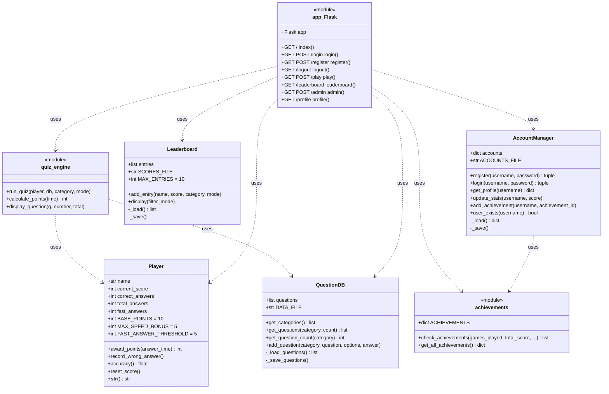

# BrainBuster 🧠

Ein konsolen- und webbasiertes Quiz-Spiel für das IT-Solutions Projekt (Lernfeld 08).

## Quick Start

```bash
# Abhängigkeiten installieren
pip install flask

# Web-App starten
python app.py
# → http://localhost:5000 im Browser öffnen

# Konsolen-Version
python main.py
python main.py h   # Hilfe

# Alle Tests ausführen
python tests.py
```

## Sequenzdiagramm

```text
Entwickler        GitHub         GitHub Actions      Runner (Ubuntu)
    |               |                  |                   |
    | git push      |                  |                   |
    |-------------->|                  |                   |
    |               | Workflow startet |                   |
    |               |----------------->|                   |
    |               |                  | Code holen        |
    |               |                  |------------------>|
    |               |                  | Python installieren|
    |               |                  |------------------>|
    |               |                  | Tests ausführen   |
    |               |                  |------------------>|
    |               |                  | Ergebnis zurück   |
    |<--------------|                  |                   |
    | Ergebnis sehen|                  |                   |
```

## Klassendiagramm



## Achievements

| Icon | Name | Bedingung |
|------|------|-----------|
| 🎮 | First Steps | Erstes Spiel abschließen |
| 🏆 | Perfect Mind | Alle Fragen richtig |
| ⚡ | Speed Demon | 3 Fragen unter 3 Sekunden |
| 💯 | Century | 100 Gesamtpunkte |
| 🎓 | Scholar | 500 Gesamtpunkte |
| 🎖 | Veteran | 10 Spiele gespielt |
| 🧠 | Quiz Master | 80% Genauigkeit (mind. 5 Fragen) |

## Punkte-System

| Ereignis | Punkte |
|----------|--------|
| Richtige Antwort | +10 |
| Speed Bonus (< 5s) | +0 bis +5 |
| Falsche Antwort | 0 |

## Team-Organisation im Scrum

```text
==========================
Leon = Developer
----------------
Aufgaben:
- Entwicklung der Software
- Implementierung neuer Features
- Erstellung und Durchführung von Tests
- Unterstützung bei der technischen Dokumentation
- Fehlerbehebung und Wartung des Codes

Robin = Scrum Master
--------------------
Aufgaben:
- Überwachung des Scrum-Prozesses
- Moderation der Sprintplanung
- Organisation von Retrospektiven
- Unterstützung des Teams bei Problemen und Hindernissen
- Pflege und Verwaltung des Scrum-Boards

Yannick = Product Owner
-----------------------
Aufgaben:
- Sammlung und Analyse der Anforderungen
- Priorisierung der Anforderungen im Product Backlog
- Abstimmung mit dem Lehrerteam und dem Auftraggeber
- Definition der Sprintziele
- Abnahme der entwickelten Funktionen

Hinweis:
Da es sich um ein kleines Projektteam handelt, übernehmen alle Teammitglieder zusätzlich Entwicklungsaufgaben und unterstützen sich gegenseitig bei Tests, Dokumentation und Qualitätssicherung.
```

## User Stories

1. Als Spieler möchte ich verschiedene Kategorien auswählen können, damit ich genau das Thema spielen kann, das mich interessiert.  
2. Als User möchte ich mich mit meinem Benutzernamen und Passwort registrieren können, damit ich beim nächsten Besuch wieder auf meinen Punktestand und meine Spielhistorie zugreifen kann.  
3. Als User möchte ich mich mit meinem Benutzernamen und Passwort einloggen können, damit ich meine Spielhistorie einsehen kann.  
4. Als Spieler möchte ich am Ende eines Spiels eine Rangliste sehen, damit ich einen Anreiz habe, mich zu verbessern und mich mit Freunden vergleichen kann.  
5. Als Spieler möchte ich das Spiel über den Browser spielen können, damit ich es auch ohne Terminal unterwegs nutzen kann.  
6. Als Spieler möchte ich einen Schwierigkeitsgrad auswählen können, damit ich das Quiz individuell an mein Wissen anpassen kann.  
7. Als Admin möchte ich über ein einfaches Web-Backend neue Quizfragen oder Kategorien hinzufügen können, damit die Datenbank ohne Code erweitert werden kann.  
8. Als Spieler möchte ich einen Online-Mehrspieler-Modus nutzen können, damit ich gegen Freunde um den Sieg spielen kann.  
